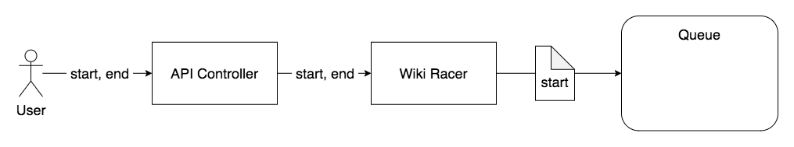

# WikiRacer 8000

Wikiracer takes a starting page and an end page (as a page title) and successfully figure out how to traverse from one to the other (or tell the user if there isn’t a path). The output would be a list of pages on the path, as well as the total elapsed time to run.

## High-level architecture 

### Overview


Current iteration of the design consists of the following concepts:

`API Controllers` - User facing API endpoints to accept incoming requests and to initiate a wiki race.

`Wiki Racer` - Primary component handling life-cycle of a race. It will initiate the race, take searches off the queue and spawn search workers. It also handles search parallelism, process search results and stop/complete the race.

`Search Workers` - Each worker is focused on one thing: check if the assigned title is directly linked to the end title. If not, pick more titles to search and queue the additional searches. The selection strategy on what titles to search next is essential and has impacts on race time.

`Queue` - Additional searches to be performed will be put onto the queue for consumption by the Wiki Racer.

`MediaWikiApi` - Primary data provider for the race. External service.

### Application Layers


The components are organized using concepts from multi-tiered deisgn. There are layers addressing cross-cutting concerns and components related to it are put under such layer.

`API` - This is where all the controllers and express middleware modules are located.

`Services` - Contains all the business logic / processer modules.

`Data Providers` - All the API clients, database repositories (if any) and cache clientss (if any) are located.

## Instructions for how to run your Wikiracer

To start, obtain the source code from the following repository through git clone:

`git clone https://github.com/captainrex8/wikiracer8000.git`

Make sure you have *docker*, *docker-compose* and *make*.

### Quick smoke test

The first step is to run the tests by running `make test`. This will build the test container and run the unit tests.

Then you could launch the application container by running `make build-run`.

Once you have the main application container up and running. You could check to see if the application is running by making a call to the ping endpoint using the following curl command:

```
curl --header "Content-Type: application/json" \
  --request GET \
  http://localhost:8089/api/v1/ping
```

If the application is running successfully, you should get a json response like this: `{"data":{"message":"I am still alive!"}}`

Unfortunately, I did not have time to build a UI to interact with the primary race API. I'd recommend using [Postman](https://www.postman.com/downloads/) for interactions with the wikiracer api endpoints. If not, the following curl command would initiate the search from Giant sloth to Sloth:

```
curl --header "Content-Type: application/json" \
  --request POST \
  --data '{"start":"Giant sloth","end":"Sloth"}' \
  http://localhost:8089/api/v1/race
```

You should get the follwoing response given the wiki pages hasn't changed much: `{"data":{"fromTitle":"Giant sloth","toTitle":"Sloth","path":["Giant sloth","Ground sloth","Sloth"]}}`

### A little bit more info on ...

#### Client side

Now you've completed the application start up check. You could start racing by changing the POST body and send it to the `race` end point. There are just 2 required parameters:

```
{
    "start": "starting title",
    "end": "destionation title"
}
```

`start` is the wiki title you would like to start racing from and `end` is the wiki title you would like the race to end at. Here's the Giant sloth to Sloth example using Postman:


#### Server side

At the same time, you could check the running container for log outputs. Here's the container log output from the Giant sloth to Sloth example:


In the above example, the first 2 log entries prefixed with info are from application start up.

The more relevant log entries are the last two lines. These are race progress logs. They have structure like this:

`[log level]: [searchId] [parent] -> [current title] | [duration] | [search queue items]`

`log level` - For race progress logs, these will always be info.

`searchId` - The id for a particular linked titles search.

`parent` - The parent title where the current title search originates from.

`duration` - Duration of the current title search. This contains the time to check if current title is directly linked with the destionation. Plus, if needed, the time to retrieve more linked titles for further searches.

`search queue items` - The number of pending title searches yet to be performed.

## What the code does



Once the user submit a request, the race will kick off by having the wikirace module putting the first title search onto the search queue.


Then launch a search worker to querying MediaWiki API for all linked titles to the starting title. Once we got the titles, the search worker will use the selection module to randomly pick a number of titles to search next and put them on the queue.


The wikirace module will then keep taking a number of searches off the queue at a time and launch search workers to look for the end title.

The race will stop on either one of the following conditions:
- We've done the race and are now at the last title before the end
- There is no more queued searches (complete dead end everywhere)
- We searched enough pages and it is time to call it quit.

## References

### *make* commands:

`make test` - This will build and launch the docker container to run the jest unit tests

`make run` - This will run the docket container using docker-compose up

`make build-run` - This will build the docker container with the main application and then run the docket container using docker-compose up. By default, the running application should be accessible through port 8089 on localhost.

`make stop` - This will stop the docker container using docker-compose down

### *yarn/npm* script targets:

`yarn start` - This will start the application on your host machine

`yarn lint` - This will check your code style against ESLint rules

`yarn test` - This will check code style first and then run unit tests with code coverage report

### *configurations*:

Configs are stored under the `config` folder. Each file represents a config for a particular environment. Environment value is determined by the `NODE_ENV` environment variable. Currently, there are 3 files:

`default.json` - Provide base configuration for any environment.

`development.json` - Config values for development environment.

`test.json` - Config values when running unit tests.

#### Configuration reference

|config                           | description                                               | type    |
|---------------------------------|-----------------------------------------------------------|---------|
|serviceName                      | name of the application                                   | string  |
|settings.numConcurrentSearches   | maximum number of search workers to query MediaWiki API   | number  |
|settings.numMaxSearches          | maximum number of queries before stopping the race        | number  |
|logger.level                     | minimum level needed for a log entry to be logged         | string  |
|express.port                     | port number for the http server                           | string  |
|express.maxRequestSize           | maximum amout of data the application will accept         | string  |
|mediaWikiApi.baseUrl             | base URL for the MediaWiki API query end point            | string  |
|mediaWikiApi.timeoutInSeconds    | http request timeout in seconds                           | number  |

### API end-points

#### /api/v1/ping

Method: GET

Sample 200 OK Response:

```
{
  "data": {
    "message":"I am still alive!"
  }
}
```

#### /api/v1/race

Method: POST

Sample Request:

```
{
  "start":"Giant sloth",
  "end":"Sloth"
}
```

Sample HTTP 200 OK Response:

```
{
  "data": {
    "startTitle":"Giant sloth",
    "endTitle":"Sloth",
    "path": [
      "Giant sloth - 233ms",
      "Ground sloth - 590ms",
      "Sloth"
    ]
  }
}
```

Sample HTTP 400 Bad Request Response:

```
{
  "error": {
    "id": "acc6be12-a792-42af-a023-8c61d47ca3d1",
    "message": "Unexpected string in JSON at position 42"
  }
}
```

## Strategies tried


### 1. Always pick first

Always pick the first linked title to search. This is mostly a test to see if the MediaWikiApi client is functioning correctly. When testing with sample race (Tennessee -> Sloth), it goes no where and always end up in loops.

### 2. Breadth first

Query all the linked titles for a given titles and iterating through them before going to the next level. The exahustive approach without parallelization is taking forever to go through everything. In the end, racing with this approach is not practical.

### 3. Parallelized depth first

This approach start out with a select number of linked titles and then launch the searches in parallel. The parallelization is small. I configured only 5 starting titles to search. In each parallel search, the search worker will randomly pick 1 linked title to search next. While this approach has increased speed, the race still didn't end. I did not investigate this approach further.

### 4. Paralleized breadth first

This approach is similar to No. 2. Instead of going through titles one by one, I search X titles at a time and search directly linked titles first before going to next level. Since amount of parallelization is configurable, I managed to go through large number of titles faster. However, due to the sheer number of titles even at level 1, the race still end up going no where. Not to mention the levels further down will exponentially more titles. This approach doesn't get us far enough fast enough from the starting point.

### 5. Paralleized breadth first with randomization

This is a modified approach similar to No. 4. Instead of queueing ALL linked titles for searching, the race now randomly pick X titles and queue them. This improves on the distance traversed within a given time. This is the current appraoch and by luck I was able to go from (Tennessee -> Sloth) a couple of times. Unfortunately, due to the random nature, the race is not consisten and has a lot of variability.

### Other strategies tried

Other than parallelizing the searches, I also experimented several approaches on title selection. As intelligently selecting the right title would cut down the amount searches needed:

- Always check to see if the current title is directly linked to the end title before retrieving all linked titles.
- Do not search anything containing starting title.
- Tried to not search titles which have been searched.
- Check to see if MediaWiki API can provide a category on a title.

## How long I've spent on each part of the project?

### MAY28

- Understand problem scope
- Research APIs: MediaWiki API
- Design
- Project scaffolding
- Setting up dev environment
- Time spent: *4 hours*

### MAY29

- Play around with the MediaWiki API and probe its capabilities
- Implement API client
- Hookup API endpoint to query a single title using the client
- Design
- Time spent: *3 hours*

### MAY30

- Trying out different strategies
- Building out wiki racer, search worker
- Writing unit tests
- Time spent: *6 hours*

### MAY31

- Trying out different strategies
- Building out wiki racer, search worker
- Writing unit tests
- Wrap up implementation of the first design (monolith)
- Time spent: *8 hours*

### JUNE01

- Documentation
- A bit of refactoring of first design
- Forward looking: designing iteration 2
- Recording a short demo
- Time spent: *6 hours*

## Issues and Iteration 2

### Issues:
- Application is not usable :(
- It is a monolith!!
- Search taking longer than expected. Usual response time is 1.5 minutes. Not acceptable for API responses.
- Sometimes the application can go into infinite loop among several titles.
- No authentication/throttling to for the api
- No friendly UI :(

### Iteration 2:
- Swagger API docs
- UI and API authentication/throttling
- Split out race creation and actual racing.