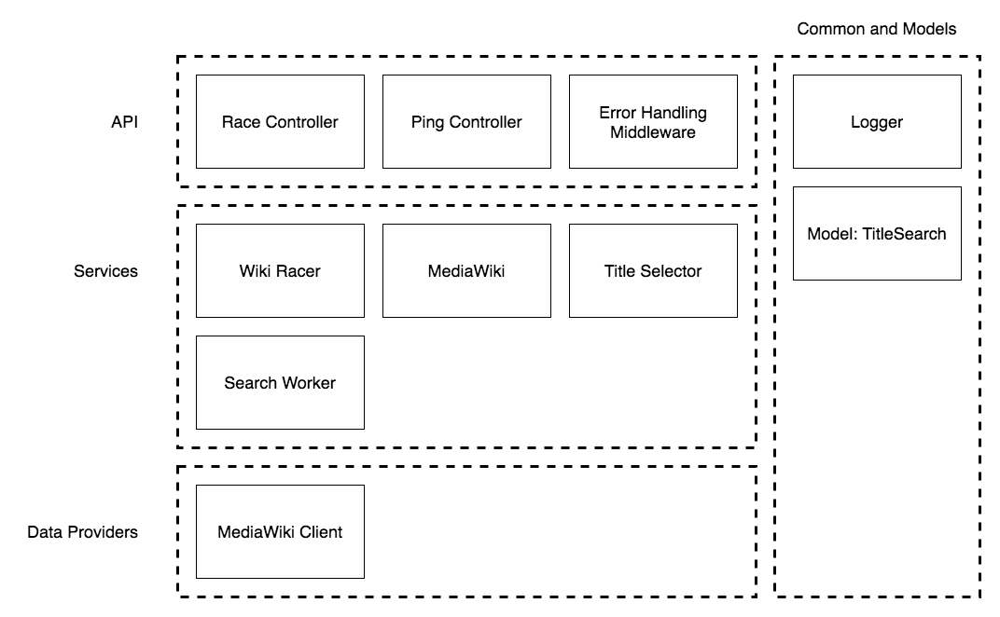

# WikiRacer 8000

Wikiracer takes a starting page and an end page (as a page title) and successfully figure out how to traverse from one to the other (or tell the user if there isn’t a path). The output would be a list of pages on the path, as well as the total elapsed time to run.

## High-level architecture 

### Overview


Concepts: Web API controllers, Wiki racer (job processor, coordinator), queue and search workers (scalable part).

### Application Layers



Multi-tier design for the web application

## Instructions for how to run your Wikiracer

To start, obtain the source code from the following repository through git clone:

`git clone https://github.com/captainrex8/wikiracer8000.git`

Make sure you have *docker*, *docker-compose* and *make*.

### Quick smoke test

The first step is to run the tests by running `make test`. This will build the test container and run the unit tests.

Then you could launch the application container by running `make build-run`.

Once you have the main application container up and running. You could check to see if the application is running by making a call to the ping endpoint using the following curl command:

```
curl --header "Content-Type: application/json" \
  --request GET \
  http://localhost:8089/api/v1/ping
```

If the application is running successfully, you should get a json response like this: `{"data":{"message":"I am still alive!"}}`

Unfortunately, I did not have time to build a UI to interact with the primary race API. I'd recommend using [Postman](https://www.postman.com/downloads/) for interactions with the wikiracer api endpoints. If not, the following curl command would initiate the search from Giant sloth to Sloth:

```
curl --header "Content-Type: application/json" \
  --request POST \
  --data '{"start":"Giant sloth","end":"Sloth"}' \
  http://localhost:8089/api/v1/race
```

You should get the follwoing response given the wiki pages hasn't changed much: `{"data":{"fromTitle":"Giant sloth","toTitle":"Sloth","path":["Giant sloth","Ground sloth","Sloth"]}}`

### A little bit more info on ...

#### Client side

Now you've completed the application start up check. You could start racing by changing the POST body and send it to the `race` end point. There are just 2 required parameters:

```
{
    "start": "starting title",
    "end": "destionation title"
}
```

`start` is the wiki title you would like to start racing from and `end` is the wiki title you would like the race to end at. Here's the Giant sloth to Sloth example using Postman:


#### Server side

At the same time, you could check the running container for log outputs. Here's the container log output from the Giant sloth to Sloth example:


In the above example, the first 2 log entries prefixed with info are from application start up.

The more relevant log entries are the last two lines. These are race progress logs. They have structure like this:

`[log level]: [searchId] [parent] -> [current title] | [duration] | [search queue items]`

`log level` - For race progress logs, these will always be info.

`searchId` - The id for a particular linked titles search.

`parent` - The parent title where the current title search originates from.

`duration` - Duration of the current title search. This contains the time to check if current title is directly linked with the destionation. Plus, if needed, the time to retrieve more linked titles for further searches.

`search queue items` - The number of pending title searches yet to be performed.

## What the code does

e.g. Flow diagram and stuff

### Arch for error handling and logging

e.g. error handling middle ware / app level error handling and logs accompanied with it

## References

### *make* commands:

`make test` - This will build and launch the docker container to run the jest unit tests

`make run` - This will run the docket container using docker-compose up

`make build-run` - This will build the docker container with the main application and then run the docket container using docker-compose up. By default, the running application should be accessible through port 8089 on localhost.

`make stop` - This will stop the docker container using docker-compose down

### *yarn/npm* script targets:

`yarn start` - This will start the application on your host machine

`yarn lint` - This will check your code style against ESLint rules

`yarn test` - This will check code style first and then run unit tests with code coverage report

### *configurations*:

Configs are stored under the `config` folder. Each file represents a config for a particular environment. Environment value is determined by the `NODE_ENV` environment variable. Currently, there are 3 files:

`default.json` - Provide base configuration for any environment.

`development.json` - Config values for development environment.

`test.json` - Config values when running unit tests.

#### Configuration reference

|config                           | description                                               | type    |
|---------------------------------|-----------------------------------------------------------|---------|
|serviceName                      | name of the application                                   | string  |
|settings.numConcurrentSearches   | maximum number of search workers to query MediaWiki API   | number  |
|settings.numMaxSearches          | maximum number of queries before stopping the race        | number  |
|logger.level                     | minimum level needed for a log entry to be logged         | string  |
|express.port                     | port number for the http server                           | string  |
|express.maxRequestSize           | maximum amout of data the application will accept         | string  |
|mediaWikiApi.baseUrl             | base URL for the MediaWiki API query end point            | string  |
|mediaWikiApi.timeoutInSeconds    | http request timeout in seconds                           | number  |


## Strategies you tried

Look into May 30/31 stuff

## How long you spent on each part of the project

May 28 – 4 hours
TODO:
Understanding problem scope, research APIs: MediaWiki API, Design, scaffolding, setting up dev environment.
May 29 – 2 hours
Play around with the MediaWiki API and see its capabilities. Implement first draft client. Design and test out a first-take solution that works.
May 30 – 4 hours
TODO: 
Test it out: Brute force pick first title go depth first search all the way. - DOESN’T WORK
Is there a way to query linked titles using keyword/prefix? - NOPE
If not, we could retrieve all the links and search keyword - DONE
If not found, maybe we could look up the category/topics for the keyword and search – DOESN’T WORK
If nothing related, then just either randomly pick 1 or pick first one - DONE
May 31 – 6 hours
TODO:
Wrap up first implementation of the racer in monolith design.
Test it out: Pick 5 random starting points and pick a random page for each subsequent linked pages. - didn’t work as planned
Test it out: Fan out and search in binary tree fashion. For each page, randomly pick 2 linked pages – didn’t work as planned
Test it out: Randomly pick configurable number of links and start going through each one and queuing same amount of links for each page. - The approach was able to return result in a reasonable amount of time a couple times. However, it is not reproducible on a consistent manner.

Several issues:
search taking longer than expected and timeout/need to convert to a job
need to handle when we hit a dead end-to-end
need to parallelize the seed calls
need to handle where we are only selecting pages starting with numbers